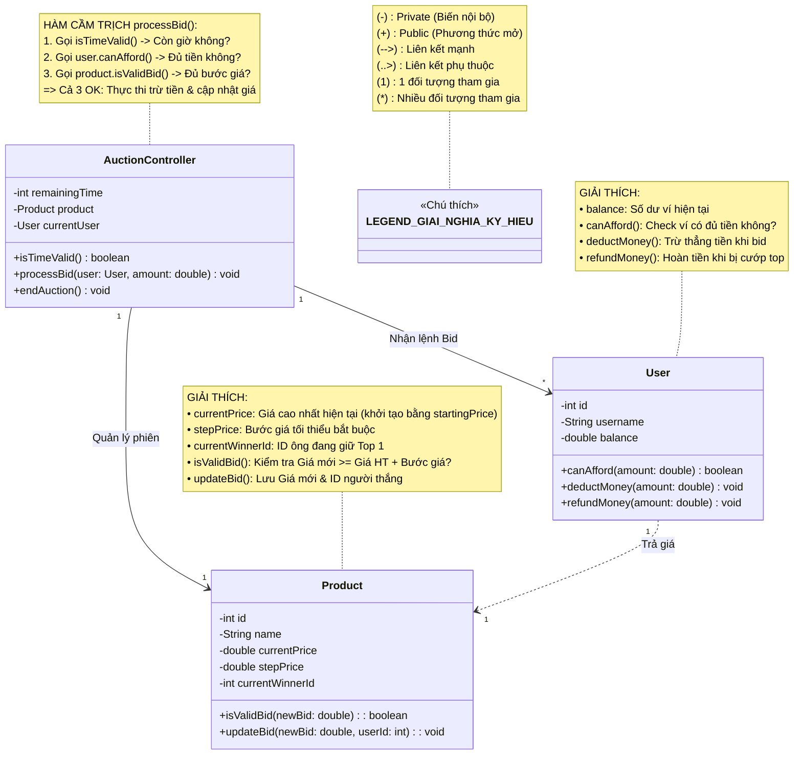
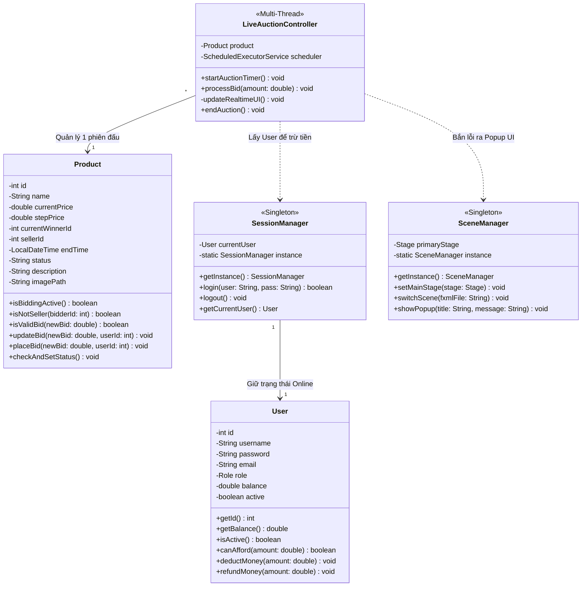
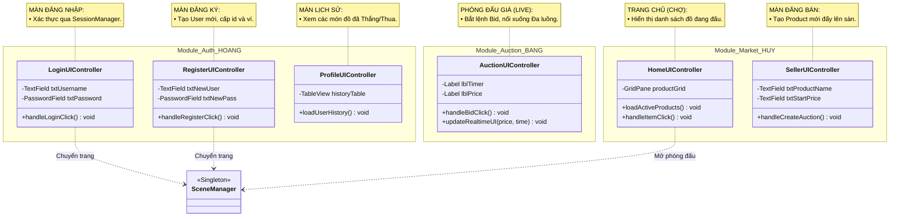
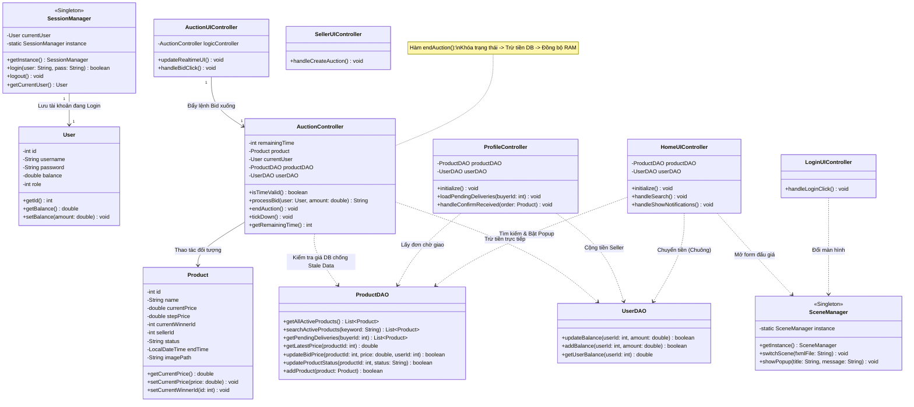

# ☕ [Phát triển hệ thống đấu giá trực tuyến] - Nhóm 13.

## 👥 Thành viên nhóm & Theo dõi tiến độ

| MSSV | Họ và tên | Phụ Trách | % Commit |
| :--- | :--- | :--- | :---: |
| 25020038 | **Lê Hữu Bằng** | **Leader / Hệ thống & logic đa luồng** | **33,3%** |
| 25020182 | **Nguyễn Nhất Huy** | **Coder / Sản phẩm & Trang chủ** | **33,3%** |
| 25020159 | **Dương Bá Việt Hoàng** | **Coder / Người dùng & Đăng nhập** | **33,3%** |

> **Cách tính % Commit:** Tổng điểm % từ các Task đã được Leader Merge vào nhánh `main`. Con số này là căn cứ duy nhất để chia điểm project.
---

## 📖 1. Giới thiệu dự án
Hệ thống đấu giá trực tuyến là nền tảng phần mềm cho phép nhiều người dùng cùng tham gia cạnh tranh giá để mua một sản phẩm trong một khoảng thời gian xác định. Dự án được phát triển bằng ngôn ngữ Java.

---

## ⚠️ 2. Quy định làm việc nhóm (Quy tắc sống còn)
* **Commit code:** Phải commit mã nguồn thường xuyên lên GitHub để chứng minh tiến độ; không chấp nhận trường hợp chỉ có một commit duy nhất vào thời điểm cuối.
* **Trách nhiệm giải trình:** Nếu bất kỳ thành viên nào không hiểu hoặc không thể giải thích bất kỳ phần mã nguồn nào, toàn bộ nhóm sẽ bị chấm 0 điểm.
* **Điểm số:** Chấm điểm theo nhóm. Nhóm tự phân chia điểm theo mức độ đóng góp, tổng điểm cá nhân bằng điểm chung của nhóm.
---

### 📊 3. Tổng quan tiến độ (Cập nhật: 28/05/2026)

*Tiến độ được đánh giá theo % khối lượng công việc thực tế đã hoàn thành và được Leader merge thành công vào nhánh chính, do các phân hệ được phát triển và lắp ghép song song.*

**Phase 1: Core Engine (Cốt lõi Logic & Dữ liệu) - BẢN V3**
`[▓▓▓▓▓▓▓▓▓▓▓▓▓▓▓▓▓▓▓▓] 100%`
> Trạng thái: Đã hoàn thiện 100% luồng nghiệp vụ kinh doanh. Tích hợp thành công Ví trung gian, thanh toán và đồng bộ RAM - Database. Sẵn sàng nghiệm thu Phase 1.

**Phase 2: Advanced Implementation (Giao diện UI & Đa luồng)**
`[▓▓▓▓▓░░░░░░░░░░░░░░░] 25%`
> Trạng thái: Đã chốt kiến trúc MVC, Design Pattern (Singleton) và phân tách tầng DAO. Đang chuẩn bị đập Lock/Synchronized vào Core để xử lý Concurrency (Đa luồng).
---

## ⚖️ 4. Luật Mở Khóa & Phân Phối Điểm (% Cố định)

### 🔒 4.1. Dependency Lock (Khóa phụ thuộc)
* **Tuyệt đối KHÔNG triển khai Advanced Features khi Core Engine chưa hoàn thiện 100%.**
* **Hình phạt:** Mọi điểm đóng góp từ các task Phase 2 sẽ bị **ĐÓNG BĂNG** (không ghi nhận) cho đến khi toàn bộ Phase 1 được Leader nghiệm thu.

### 🤝 4.2. Cơ chế Hỗ trợ (Assist) & Review qua GitHub
* **Xác nhận hỗ trợ:** Thành viên chỉ được sửa code người khác khi đã tạo 1 **GitHub Issue**, tag tên người hỗ trợ và được xác nhận (Comment "Chốt" hoặc "Đồng ý") trong Issue đó.
* **Chia sẻ quyền lợi:** Nếu hỗ trợ fix logic quan trọng (>30% module), người hỗ trợ hưởng **50% số điểm** task đó (trừ trực tiếp từ người nhận task chính).
* **Leader Review:** Nếu Pull Request (PR) có lỗi, Leader trả bài. Tự sửa thành công -> 100% điểm. Nếu để Leader phải can thiệp sửa hộ để chạy được -> **Trừ 50% điểm** task đó chuyển cho Leader.

### 🎯 4.3. Bảng Quy đổi Trọng số & Độ khó (Tier List)
*Hệ thống task được phân loại 1-1 giữa Độ khó và Điểm đóng góp để đảm bảo tính công bằng tuyệt đối.*

| Thang Rank | Trọng số | Mức độ | Tiêu chí đánh giá & Đặc thù công việc |
| :--- | :---: | :--- | :--- |
| **Rank SS** | **20%** | Cực khó 🔥 | **Core công nghệ:** Thuật toán đa luồng (Concurrency), chống Race Condition. Quyết định sức mạnh kiến trúc và sự sống còn của hệ thống. |
| **Rank S+** | **15%** | Rất khó ⚡ | **Trái tim dự án:** Logic nghiệp vụ cốt lõi (Bidding Logic). Đòi hỏi tư duy thuật toán sâu, không được phép có bug thất thoát dữ liệu. |
| **Rank S** | **12%** | Khó 🧠 | **Đồng bộ hóa:** Xử lý thời gian thực (Realtime), bộ đếm ngược (Timer), và chuyển đổi trạng thái vòng đời sản phẩm tự động. |
| **Rank A+** | **10%** | Khá ⚙️ | **Tính năng trụ cột:** Xây dựng luồng CRUD, thiết kế Database. Không quá đánh đố về tư duy nhưng tốn rất nhiều công sức cày cuốc. |
| **Rank A** | **8%** | Tiêu chuẩn 🎨 | **Giao diện & Hiển thị:** Kéo thả UI, thiết kế các màn hình JavaFX/Swing. Đòi hỏi tính thẩm mỹ, cẩn thận và bắt luồng sự kiện chuẩn xác. |
| **Rank B+** | **5%** | Nền tảng 🧱 | **Kỹ thuật phần mềm:** Việc lặt vặt nhưng là "chốt chặn" điểm số: setup kiến trúc, CI/CD, viết Unit Test, Design Pattern và bắt lỗi cơ bản. |

### ⏱️ 4.4. Lưu ý đặc biệt: Quy tắc "Xí phần" & Hiệu lực
* **Giới hạn & Thời hạn:** Mỗi thành viên chỉ được giữ tối đa **2 Task** chưa xong cùng lúc. Sau **3 ngày** claim task mà không có Commit chứng minh tiến độ -> Leader có quyền **thu hồi (Unassign)** ngay lập tức để mở cho người khác làm.
---

## 📦 5. Phân công công việc (Tổng 110%)

### 🏗️ Phase 1 - Bắt buộc (60%)
*Hoàn thành 100% Phase này để nắm chắc 6 điểm và mở khóa Phase 2.*

- [ ] **Core Logic Đấu giá** (Rank S+ - 15%)
  - *Mô tả:* Trái tim dự án. Thuật toán nhận giá, so sánh, kiểm tra bước giá hợp lệ.
  - *Phụ trách:* `Toàn nhóm (Tích hợp thông qua OOP - Xem sơ đồ mục 6)`
- [ ] **Lifecycle & Trạng thái** (Rank S - 12%)
  - *Mô tả:* Xử lý Timer đếm ngược, tự động chốt phiên và đổi trạng thái sản phẩm.
  - *Phụ trách:* `Lê Hữu Bằng`
- [ ] **Quản lý Người dùng** (Rank A+ - 10%)
<<<<<<< HEAD
  - *Mô tả:* Cấu trúc DB, Đăng ký/Đăng nhập, Phân quyền (Admin/Seller/Bidder).
  - *Phụ trách:* `[Dương Bá Việt Hoàng]`
- [ ] **Quản lý Sản phẩm** (Rank A+ - 10%)
  - *Mô tả:* Seller thêm/sửa/xóa sản phẩm, duyệt hình ảnh và thông tin.
=======
  - *Mô tả:* Cấu trúc User, Đăng ký/Đăng nhập, Logic trừ/hoàn tiền.
  - *Phụ trách:* `Dương Bá Việt Hoàng`
- [ ] **Quản lý Sản phẩm** (Rank A+ - 10%)
  - *Mô tả:* Seller thêm/sửa/xóa sản phẩm, logic duyệt giá đấu.
>>>>>>> develop
  - *Phụ trách:* `Nguyễn Nhất Huy`
- [ ] **Giao diện (UI JavaFX/Swing)** (Rank A - 8%)
  - *Mô tả:* Vẽ các màn hình. **Quy tắc:** Ai code logic phần nào, tự kéo UI màn hình phần đó.
  - *Phụ trách:* `Toàn nhóm`
- [ ] **Xử lý lỗi (Exceptions)** (Rank B+ - 5%)
  - *Mô tả:* Validate đầu vào (chống nhập bậy), try-catch để app không bị crash.
  - *Phụ trách:* `Nguyễn Nhất Huy`
<<<<<<< HEAD

---
=======
>>>>>>> develop

### 🚀 Phase 2 - Nâng cao (40%)
*Phần phân loại sinh viên Khá/Giỏi. Yêu cầu tuân thủ chặt chẽ kiến trúc.*

- [ ] **Concurrency (Đa luồng)** (Rank SS - 20%) 🔥
  - *Mô tả:* Dùng Lock/Synchronized chống Race Condition khi nhiều người bid cùng 1 giây.
  - *Phụ trách:* `[Trống - Đợi claim]`
- [ ] **Realtime Update (Socket/Observer)** (Rank A+ - 10%)
  - *Mô tả:* Push dữ liệu giá mới nhất về toàn bộ Client ngay lập tức.
  - *Phụ trách:* `[Trống - Đợi claim]`
- [ ] **Client-Server & MVC** (Rank B+ - 5%)
  - *Mô tả:* Tách biệt kiến trúc Controller/DAO/Model chuẩn mực, giao tiếp qua mạng.
  - *Phụ trách:* `[Trống - Đợi claim]`
- [ ] **Unit Test & Design Patterns** (Rank B+ - 5%)
  - *Mô tả:* Áp dụng Singleton/Factory; viết JUnit bảo vệ Core Logic.
  - *Phụ trách:* `[Trống - Đợi claim]`

### 🎁 Nhóm Bonus (Tối đa 10%)
*Điểm thưởng cộng thêm cho nhóm (Vét điểm tuyệt đối).*

- [ ] **Auto-Bid & Anti-sniping** (Rank B+ - 5%)
  - *Mô tả:* Logic tự động gia hạn thời gian (sniping) và tự động trả giá trần.
  - *Phụ trách:* `[Trống - Đợi claim]`
- [ ] **Chart / CI/CD Actions** (Rank B+ - 5%)
  - *Mô tả:* Vẽ biểu đồ lịch sử giá realtime hoặc setup GitHub Actions tự động test.
  - *Phụ trách:* `[Trống - Đợi claim]`

*Ghi chú: Bài tập lớn chiếm trọng số ~30% tổng điểm môn học. Anh em tập trung claim task và triển khai đúng tiến độ.*

---

## 🗺️ 6. Sơ đồ Kiến trúc & Quản lý Lớp (UML - V1) - Core Engine
*Sơ đồ này là hợp đồng kỹ thuật cho Phase 1. Các thành viên bắt buộc tuân thủ tên phương thức để Leader tiến hành ghép code.*

---

## 🗺️ 7. Sơ đồ Kiến trúc mở rộng (UML - V2) - Tích hợp UI và Realtime

### 📖 Từ điển Giải nghĩa Kiến trúc V2 (UML Glossary)

**1. Tầng Dữ liệu (Data Model) - Phân hệ tĩnh**

* **`User`**: Đại diện cho người dùng hệ thống. 
    * *Cập nhật V2:* Tích hợp thêm tính năng Phân quyền (`role`, `email`) và Khóa tài khoản (`active`). Tự quản lý ví tiền thông qua hàm `canAfford()` (check số dư) và `deductMoney()` (trừ tiền).
* **`Product`**: Đại diện cho vật phẩm trên sàn đấu giá.
    * *Cập nhật V2:* Nâng cấp thành Model thông minh. Tự chứa mốc thời gian đóng phiên (`endTime`) và logic chặn chủ đồ tự đấu giá (`sellerId`). Bao gồm `description` và `imagePath` để đổ dữ liệu ra JavaFX. Phương thức `updateBid()` được gắn `synchronized` để chống lỗi Race Condition.

**2. Tầng Lõi Hệ thống (System Core) - Hạ tầng điều phối**

* **`SessionManager`**: Quản lý phiên làm việc. Khởi tạo một lần duy nhất (`Singleton`). Lưu trữ thông tin của người dùng vừa đăng nhập thành công. Các Module (Chợ, Đấu giá) sẽ gọi `getCurrentUser()` để biết chính xác ai đang thao tác.
* **`SceneManager`**: Gác cổng giao diện. Nắm giữ Cửa sổ chính (`primaryStage`). Thay vì mở nhiều cửa sổ lộn xộn, mọi lệnh chuyển trang ĐỀU PHẢI gọi qua hàm `switchScene()`. Hàm `showPopup()` dùng để quăng thông báo lỗi (ví dụ: Không đủ tiền, Giá không hợp lệ) ra màn hình cho người dùng.

**3. Tầng Logic Đa luồng (Business Logic) - Trái tim hệ thống**

* **`LiveAuctionController`**: Trình điều khiển phòng đấu giá trực tiếp (Cốt lõi Đa luồng).
    * **`scheduler`**: Dùng `ScheduledExecutorService` (thay cho Thread cơ bản) để tạo bộ đếm ngược thời gian chuẩn xác từng giây, liên tục gọi hàm `checkAndSetStatus()` của Product để cập nhật trạng thái.
    * **`processBid(amount)`**: Luồng xử lý đặt giá chuyên sâu. Khi UI gọi hàm này, Controller sẽ: 
        1. Gọi `SessionManager` lấy User hiện tại.
        2. Check `User.canAfford(amount)` xem ví đủ tiền không.
        3. Try-Catch gọi `Product.placeBid()`. Nếu Product ném ra `Exception` (lỗi giá thấp, tự

---

## 🖥️ 8. Kiến trúc Giao diện (Tầng View - UI)
*Mô tả cách các màn hình giao diện JavaFX kết nối với hệ thống Core ở trên. Đảm bảo tuân thủ nguyên tắc: UI không tự xử lý logic.

### 📖 Từ điển Giải nghĩa Giao diện (UI Controllers)

**1. Phân hệ Tài khoản (Module_Auth_HOANG)**

* **`LoginUIController`**: Nắm màn hình Đăng nhập. Nhiệm vụ: Lấy Text từ ô nhập -> Trực tiếp gọi `SessionManager.login()`. Nếu trả về `true` (thành công) thì gọi `SceneManager` để chuyển sang màn Home.
* **`RegisterUIController`**: Nắm màn hình Đăng ký. Nhiệm vụ: Gom dữ liệu -> Tạo đối tượng `User` mới -> Đẩy vào hệ thống. Xong xuôi thì đẩy người dùng về lại màn Đăng nhập.
* **`ProfileUIController`**: Nắm màn hình Lịch sử. Nhiệm vụ: Gọi `SessionManager.getCurrentUser()` để biết ai đang xem -> Lọc danh sách sản phẩm ông này đã thắng/thua để hiển thị lên bảng (`TableView`).

**2. Phân hệ Chợ & Bán hàng (Module_Market_HUY)**

* **`HomeUIController`**: Nắm Trang chủ. Nhiệm vụ: Load toàn bộ `Product` đang có trạng thái "Đang đấu" lên lưới (`GridPane`). Khi click vào một món -> Gọi `SceneManager` mở Phòng đấu giá (kèm theo ID sản phẩm).
* **`SellerUIController`**: Nắm form Đăng bán. Nhiệm vụ: Validate dữ liệu (không nhập giá âm, tên không để trống) -> Tạo đối tượng `Product` mới đẩy lên sàn.

**3. Phân hệ Live Auction (Module_Auction_BANG)**

* **`AuctionUIController`**: Nắm Phòng đấu giá trực tiếp. Nhiệm vụ:
    * Nhận dữ liệu Realtime từ `LiveAuctionController` (Core) để cập nhật liên tục `lblTimer` (Đồng hồ) và `lblPrice` (Giá).
    * Khi bấm Bid -> Đẩy lệnh xuống `processBid()` của Tầng Logic. **Tuyệt đối UI không tự xử lý tính toán trừ tiền.**

**👉 Nguyên tắc cốt lõi toàn Phase 2:**

---

## 🗺️ 9. Kiến trúc N-Tầng liên kết lỏng & Tương hỗ (UML - V3) - Hoàn thiện Phase 1
*Sơ đồ thể hiện toàn bộ vòng đời ứng dụng, từ giao diện người dùng (UI) đi qua lõi xử lý (Logic/Core) và tương tác với cơ sở dữ liệu (DAO).*

### 📖 A. Từ điển Giải nghĩa Giao diện (UI & Core Controllers) - V3

**1. Phân hệ Tài khoản & Lịch sử (Module_Auth_HOANG)**

* **`LoginUIController` / `RegisterUIController`**: Nắm cổng bảo mật. Giao tiếp với `SessionManager` để thiết lập phiên làm việc (Session) duy nhất. Toàn quyền điều hướng sau khi xác thực thành công.
* **`ProfileController` (Nâng cấp V3)**: Quản lý ví trung gian. Nhiệm vụ: Đọc luồng dữ liệu đơn hàng trạng thái "Chờ giao hàng". Khởi chạy hàm `handleConfirmReceived()` để xác nhận nhả tiền (release fund) vào ví người bán, khép kín vòng đời 1 giao dịch.

**2. Phân hệ Thị trường & Tìm kiếm (Module_Market_HUY)**

* **`HomeUIController` (Nâng cấp V3)**: Trái tim của giao diện người dùng. Nhiệm vụ: 
    * Load danh sách sản phẩm hiển thị lưới (`GridPane`).
    * **[New]** Cung cấp bộ lọc tìm kiếm Realtime qua `handleSearch()`.
    * **[New]** Quản lý Notification Popup (Chuông báo): Trực tiếp chọc xuống `ProductDAO` cào dữ liệu đơn hàng chờ nhận lên cửa sổ nổi (Modal), tích hợp tính năng khóa nút (Anti-Spam Click) chống giao dịch kép.
* **`SellerUIController`**: Nắm form Đăng bán. Kiểm duyệt tính hợp lệ của dữ liệu (Validation) trước khi đóng gói thành đối tượng `Product` ném xuống tầng DAO.

**3. Phân hệ Đấu giá Cốt lõi (Module_Auction_BANG)**

* **`AuctionUIController` (Tầng View)**: Nắm Phòng đấu giá trực tiếp. Nhiệm vụ duy nhất là "bù nhìn giao diện": Nhận sự kiện click của user và cập nhật text (Giờ/Giá). **Tuyệt đối không nhúng tay vào tính toán hay gọi Database.**
* **`AuctionController` (Tầng Logic / Bộ não V3)**: Kẻ cầm trịch vòng đời sản phẩm. Nhiệm vụ:
    * Chống Stale Data: Gọi `getLatestPrice` từ DB trước khi chốt giá.
    * Quản lý Ví (Escrow): Gọi `endAuction()` để chuyển trạng thái đồ sang "Chờ giao hàng" và trừ tiền ví người mua.
    * Đồng bộ RAM - DB: Đảm bảo giao diện nhảy số tiền khớp với cơ sở dữ liệu sau mỗi lượt Bid.

**👉 Nguyên tắc cốt lõi toàn Phase 1 - V3:**

Tất cả các hàm tương tác CSDL phải được gọi qua tầng `DAO`. UI chỉ làm nhiệm vụ giao tiếp người dùng, ủy quyền (Delegate) toàn bộ logic nghiệp vụ (trừ/cộng tiền, check tính hợp lệ) cho Tầng Core (`AuctionController`).

### 🛠️ B. Các kỹ thuật tối ưu cốt lõi (Technical Highlights - V3)

Hệ thống V3 không chỉ đáp ứng luồng nghiệp vụ cơ bản mà còn áp dụng các tiêu chuẩn thiết kế phần mềm để đảm bảo tính ổn định và toàn vẹn dữ liệu:

* **1. Áp dụng Singleton Pattern (Quản lý trạng thái tập trung):**
  * **Triển khai:** Khởi tạo duy nhất một instance cho `SessionManager` và `SceneManager`.
  * **Mục đích:** Quản lý tập trung trạng thái phiên đăng nhập (Session) và điều hướng cửa sổ (Stage) toàn cục. Tối ưu hóa tài nguyên RAM, ngăn chặn lỗi memory leak (rò rỉ bộ nhớ) do khởi tạo đối tượng dư thừa.

* **2. Cơ chế chống Stale Data (Dữ liệu lỗi thời):**
  * **Triển khai:** Trong phương thức `processBid`, hệ thống buộc phải gọi `getLatestPrice` từ CSDL ngay tại thời điểm thực thi, bỏ qua giá trị đang lưu tạm trên RAM.
  * **Mục đích:** Đảm bảo tính nhất quán của dữ liệu. Ngăn chặn tình trạng 2 người dùng nhìn thấy cùng một mức giá cũ và thực hiện ghi đè (Overwrite) sai bước giá của nhau.

* **3. Kiến trúc Ví trung gian (Escrow Pattern):**
  * **Triển khai:** Tách biệt luồng dòng tiền thành 2 pha độc lập: Khóa trừ tiền người mua (khi phiên đấu giá kết thúc) và Kích hoạt giải ngân cho người bán (thông qua hàm `handleConfirmReceived`).
  * **Mục đích:** Đảm bảo an toàn tài chính và tính toàn vẹn của giao dịch (ACID). Người bán chỉ nhận được tiền khi trạng thái vòng đời sản phẩm chính thức chuyển sang "Đã hoàn thành".

* **4. Cơ chế khóa sự kiện UI (Anti-Double Click / UI Locking):**
  * **Triển khai:** Thiết lập `btnReceive.setDisable(true)` ngay khi Thread bắt được sự kiện click đầu tiên từ người dùng.
  * **Mục đích:** Chặn đứng lỗi giao dịch kép (Duplicate Transactions) sinh ra do người dùng spam click (Race Condition ở tầng giao diện) trước khi CSDL kịp phản hồi.

* **5. Phân tách trách nhiệm (Separation of Concerns - SoC):**
  * **Triển khai:** Tuân thủ chặt chẽ mô hình MVC kết hợp DAO. 
  * **Mục đích:** Tầng Giao diện (UI Controller) hoàn toàn không chứa logic tính toán. Toàn bộ tác vụ kiểm tra tính hợp lệ, tính toán số dư và gọi CSDL được ủy quyền (Delegation) 100% cho tầng Logic (`AuctionController` và `DAO`). Đảm bảo code dễ bảo trì và mở rộng cho Phase 2 (Đa luồng).

 ### 💻 C. Giải pháp Lập trình Đặc thù (Coding Patterns & Mechanics - V3)

Để giải quyết các bài toán biên (Edge Cases) trong quá trình vận hành luồng nghiệp vụ, hệ thống V3 áp dụng các kỹ thuật lập trình đặc thù sau:

* **1. Kiểm soát tính lũy đẳng tầng Giao diện (Idempotency Control via UI Disabling):**
  * *Vấn đề:* Người dùng click liên tiếp (Spam click) nút "Đã nhận được hàng" tạo ra nhiều luồng yêu cầu trùng lặp gửi xuống máy chủ trước khi CSDL kịp phản hồi.
  * *Giải pháp:* Ngay dòng đầu tiên của phương thức xử lý sự kiện (Event Handler), hệ thống thực thi lệnh `btnReceive.setDisable(true)` để khóa trạng thái tương tác của nút bấm. Lệnh giải phóng (`setDisable(false)`) chỉ được đặt trong khối `else/catch` nếu quá trình gọi CSDL thất bại. Kỹ thuật này đảm bảo một giao dịch tài chính chỉ được thực thi duy nhất một lần (Idempotent).

* **2. Cơ chế đồng bộ hóa bộ nhớ cục bộ (State Invalidation Check):**
  * *Vấn đề:* Sau khi thực hiện lệnh trừ tiền thành công dưới CSDL, số dư của người dùng lưu trên RAM (`SessionManager`) sẽ bị cũ (Out of sync).
  * *Giải pháp:* Trong phương thức `endAuction()`, hệ thống thực hiện kiểm tra chéo điều kiện: `if (loginUser != null && loginUser.getId() == winnerId)`. Thao tác cập nhật lại thuộc tính `setBalance` trên RAM chỉ được chạy nếu người đang đăng nhập trùng khớp với ID người thắng cuộc, đảm bảo tính nhất quán dữ liệu giữa RAM và CSDL mà không cần phải thực hiện lại lệnh `SELECT` toàn bộ bảng.

* **3. Cơ chế Database-Driven Validation (Chống Stale Data):**
  * *Vấn đề:* Kiểm tra tính hợp lệ của bước giá dựa trên thuộc tính `currentPrice` của đối tượng `Product` sẵn có trên RAM dễ dẫn đến lỗi ghi đè dữ liệu cũ.
  * *Giải pháp:* Hệ thống tách biệt hoàn toàn luồng lấy giá. Phương thức `processBid` buộc phải gọi hàm `productDAO.getLatestPrice(id)` để thực hiện một câu lệnh `SELECT` độc lập xuống MySQL ngay trước khi so sánh bước giá. Trọng tài quyết định tính hợp lệ của giá đặt luôn là dữ liệu thời gian thực (Realtime) dưới CSDL, không phải dữ liệu tĩnh trên bộ nhớ Java.

* **4. Thiết lập mô hình Máy trạng thái tuần tự (Sequential State Machine):**
  * *Vấn đề:* Quản lý vòng đời sản phẩm từ lúc đấu giá đến khi giao nhận và hoàn thành mà không làm xung đột dữ liệu.
  * *Giải pháp:* Trạng thái vật phẩm không chuyển trực tiếp từ `'Đang đấu giá'` sang `'Đã kết thúc'`. Hệ thống chèn vào một trạng thái trung gian là `'Chờ giao hàng'`. Trạng thái này đóng vai trò làm điều kiện lọc (`WHERE status = 'Chờ giao hàng' AND current_winner_id = ?`) cho phương thức `getPendingDeliveries`, giúp hệ thống cô lập được các đơn hàng cần xử lý mà không làm ảnh hưởng đến các sản phẩm đã đóng cấu trúc.
