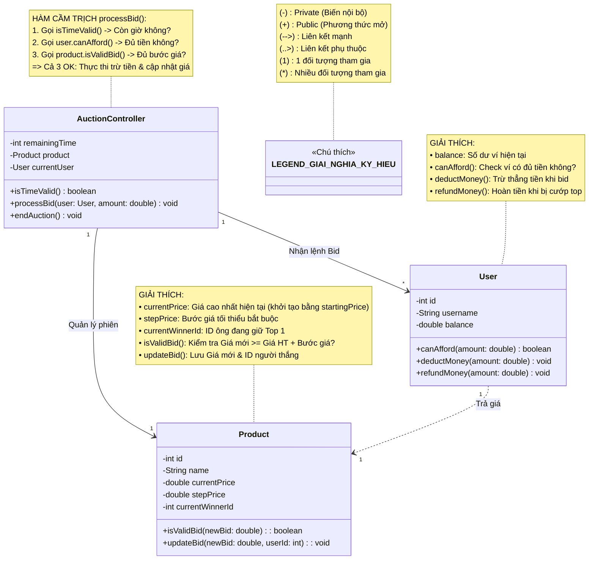
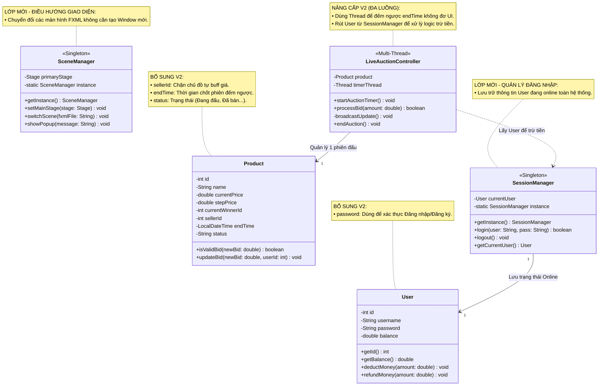

# ☕ [Phát triển hệ thống đấu giá trực tuyến] - Nhóm 13.

## 👥 Thành viên nhóm & Theo dõi tiến độ

| MSSV | Họ và tên | Vai trò chuyên môn | % Commit | Trạng thái |
| :--- | :--- | :--- | :---: | :--- |
| 25020038 | **Lê Hữu Bằng** | **Leader / Quản lý Trạng thái & Timer** |  |  |
| 25020182 | **Nguyễn Nhất Huy** | **Coder / Quản lý Sản phẩm** |  |  |
| 25020159 | **Dương Bá Việt Hoàng** | **Coder / Quản lý Người dùng** |  |  |

> **Cách tính % Commit:** Tổng điểm % từ các Task đã được Leader Merge vào nhánh `main`. Con số này là căn cứ duy nhất để chia điểm project.
---

## 📖 1. Giới thiệu dự án
Hệ thống đấu giá trực tuyến là nền tảng phần mềm cho phép nhiều người dùng cùng tham gia cạnh tranh giá để mua một sản phẩm trong một khoảng thời gian xác định. Dự án được phát triển bằng ngôn ngữ Java.

---

## ⚠️ 2. Quy định làm việc nhóm (Quy tắc sống còn)
* **Commit code:** Phải commit mã nguồn thường xuyên lên GitHub để chứng minh tiến độ; không chấp nhận trường hợp chỉ có một commit duy nhất vào thời điểm cuối.
* **Trách nhiệm giải trình:** Nếu bất kỳ thành viên nào không hiểu hoặc không thể giải thích bất kỳ phần mã nguồn nào, toàn bộ nhóm sẽ bị chấm 0 điểm.
* **Điểm số:** Chấm điểm theo nhóm. Nhóm tự phân chia điểm theo mức độ đóng góp, tổng điểm cá nhân bằng điểm chung của nhóm.
---

## 📊 3. Tổng quan tiến độ (Cập nhật: 16/04/2026)

**Core Engine:** 0/6 Module hoàn thành

**Advanced Implementation:** 0/7 Module hoàn thành

---

## ⚖️ 4. Luật Mở Khóa & Phân Phối Điểm (% Cố định)

### 🔒 4.1. Dependency Lock (Khóa phụ thuộc)
* **Tuyệt đối KHÔNG triển khai Advanced Features khi Core Engine chưa hoàn thiện 100%.**
* **Hình phạt:** Mọi điểm đóng góp từ các task Phase 2 sẽ bị **ĐÓNG BĂNG** (không ghi nhận) cho đến khi toàn bộ Phase 1 được Leader nghiệm thu.

### 🤝 4.2. Cơ chế Hỗ trợ (Assist) & Review qua GitHub
* **Xác nhận hỗ trợ:** Thành viên chỉ được sửa code người khác khi đã tạo 1 **GitHub Issue**, tag tên người hỗ trợ và được xác nhận (Comment "Chốt" hoặc "Đồng ý") trong Issue đó.
* **Chia sẻ quyền lợi:** Nếu hỗ trợ fix logic quan trọng (>30% module), người hỗ trợ hưởng **50% số điểm** task đó (trừ trực tiếp từ người nhận task chính).
* **Leader Review:** Nếu Pull Request (PR) có lỗi, Leader trả bài. Tự sửa thành công -> 100% điểm. Nếu để Leader phải can thiệp sửa hộ để chạy được -> **Trừ 50% điểm** task đó chuyển cho Leader.

### 🎯 4.3. Bảng Quy đổi Trọng số & Độ khó (Tier List)
*Hệ thống task được phân loại 1-1 giữa Độ khó và Điểm đóng góp để đảm bảo tính công bằng tuyệt đối.*

| Thang Rank | Trọng số | Mức độ | Tiêu chí đánh giá & Đặc thù công việc |
| :--- | :---: | :--- | :--- |
| **Rank SS** | **20%** | Cực khó 🔥 | **Core công nghệ:** Thuật toán đa luồng (Concurrency), chống Race Condition. Quyết định sức mạnh kiến trúc và sự sống còn của hệ thống. |
| **Rank S+** | **15%** | Rất khó ⚡ | **Trái tim dự án:** Logic nghiệp vụ cốt lõi (Bidding Logic). Đòi hỏi tư duy thuật toán sâu, không được phép có bug thất thoát dữ liệu. |
| **Rank S** | **12%** | Khó 🧠 | **Đồng bộ hóa:** Xử lý thời gian thực (Realtime), bộ đếm ngược (Timer), và chuyển đổi trạng thái vòng đời sản phẩm tự động. |
| **Rank A+** | **10%** | Khá ⚙️ | **Tính năng trụ cột:** Xây dựng luồng CRUD, thiết kế Database. Không quá đánh đố về tư duy nhưng tốn rất nhiều công sức cày cuốc. |
| **Rank A** | **8%** | Tiêu chuẩn 🎨 | **Giao diện & Hiển thị:** Kéo thả UI, thiết kế các màn hình JavaFX/Swing. Đòi hỏi tính thẩm mỹ, cẩn thận và bắt luồng sự kiện chuẩn xác. |
| **Rank B+** | **5%** | Nền tảng 🧱 | **Kỹ thuật phần mềm:** Việc lặt vặt nhưng là "chốt chặn" điểm số: setup kiến trúc, CI/CD, viết Unit Test, Design Pattern và bắt lỗi cơ bản. |

### ⏱️ 4.4. Lưu ý đặc biệt: Quy tắc "Xí phần" & Hiệu lực
* **Giới hạn & Thời hạn:** Mỗi thành viên chỉ được giữ tối đa **2 Task** chưa xong cùng lúc. Sau **3 ngày** claim task mà không có Commit chứng minh tiến độ -> Leader có quyền **thu hồi (Unassign)** ngay lập tức để mở cho người khác làm.
---

## 📦 5. Phân công công việc (Tổng 110%)

### 🏗️ Phase 1 - Bắt buộc (60%)
*Hoàn thành 100% Phase này để nắm chắc 6 điểm và mở khóa Phase 2.*

- [ ] **Core Logic Đấu giá** (Rank S+ - 15%)
  - *Mô tả:* Trái tim dự án. Thuật toán nhận giá, so sánh, kiểm tra bước giá hợp lệ.
  - *Phụ trách:* `Toàn nhóm (Tích hợp thông qua OOP - Xem sơ đồ mục 6)`
- [ ] **Lifecycle & Trạng thái** (Rank S - 12%)
  - *Mô tả:* Xử lý Timer đếm ngược, tự động chốt phiên và đổi trạng thái sản phẩm.
  - *Phụ trách:* `Lê Hữu Bằng`
- [ ] **Quản lý Người dùng** (Rank A+ - 10%)
  - *Mô tả:* Cấu trúc User, Đăng ký/Đăng nhập, Logic trừ/hoàn tiền.
  - *Phụ trách:* `Dương Bá Việt Hoàng`
- [ ] **Quản lý Sản phẩm** (Rank A+ - 10%)
  - *Mô tả:* Seller thêm/sửa/xóa sản phẩm, logic duyệt giá đấu.
  - *Phụ trách:* `Nguyễn Nhất Huy`
- [ ] **Giao diện (UI JavaFX/Swing)** (Rank A - 8%)
  - *Mô tả:* Vẽ các màn hình. **Quy tắc:** Ai code logic phần nào, tự kéo UI màn hình phần đó.
  - *Phụ trách:* `Toàn nhóm`
- [ ] **Xử lý lỗi (Exceptions)** (Rank B+ - 5%)
  - *Mô tả:* Validate đầu vào (chống nhập bậy), try-catch để app không bị crash.
  - *Phụ trách:* `Nguyễn Nhất Huy`

### 🚀 Phase 2 - Nâng cao (40%)
*Phần phân loại sinh viên Khá/Giỏi. Yêu cầu tuân thủ chặt chẽ kiến trúc.*

- [ ] **Concurrency (Đa luồng)** (Rank SS - 20%) 🔥
  - *Mô tả:* Dùng Lock/Synchronized chống Race Condition khi nhiều người bid cùng 1 giây.
  - *Phụ trách:* `[Trống - Đợi claim]`
- [ ] **Realtime Update (Socket/Observer)** (Rank A+ - 10%)
  - *Mô tả:* Push dữ liệu giá mới nhất về toàn bộ Client ngay lập tức.
  - *Phụ trách:* `[Trống - Đợi claim]`
- [ ] **Client-Server & MVC** (Rank B+ - 5%)
  - *Mô tả:* Tách biệt kiến trúc Controller/DAO/Model chuẩn mực, giao tiếp qua mạng.
  - *Phụ trách:* `[Trống - Đợi claim]`
- [ ] **Unit Test & Design Patterns** (Rank B+ - 5%)
  - *Mô tả:* Áp dụng Singleton/Factory; viết JUnit bảo vệ Core Logic.
  - *Phụ trách:* `[Trống - Đợi claim]`

### 🎁 Nhóm Bonus (Tối đa 10%)
*Điểm thưởng cộng thêm cho nhóm (Vét điểm tuyệt đối).*

- [ ] **Auto-Bid & Anti-sniping** (Rank B+ - 5%)
  - *Mô tả:* Logic tự động gia hạn thời gian (sniping) và tự động trả giá trần.
  - *Phụ trách:* `[Trống - Đợi claim]`
- [ ] **Chart / CI/CD Actions** (Rank B+ - 5%)
  - *Mô tả:* Vẽ biểu đồ lịch sử giá realtime hoặc setup GitHub Actions tự động test.
  - *Phụ trách:* `[Trống - Đợi claim]`

*Ghi chú: Bài tập lớn chiếm trọng số ~30% tổng điểm môn học. Anh em tập trung claim task và triển khai đúng tiến độ.*

---

## 🗺️ 6. Sơ đồ Kiến trúc & Quản lý Lớp (UML - V1) - Core Engine
*Sơ đồ này là hợp đồng kỹ thuật cho Phase 1. Các thành viên bắt buộc tuân thủ tên phương thức để Leader tiến hành ghép code.*

---

## 🗺️ 7. Sơ đồ Kiến trúc mở rộng (UML - V2) - Tích hợp UI và Realtime

## 🖥️ 8. Kiến trúc Giao diện (Tầng View - UI)
*Mô tả cách các màn hình giao diện JavaFX kết nối với hệ thống Core ở trên. Đảm bảo tuân thủ nguyên tắc: UI không tự xử lý logic.

### 📖 Từ điển Giải nghĩa Giao diện (UI Controllers)

**1. Phân hệ Tài khoản (Module_Auth_HOANG)**

* **`LoginUIController`**: Nắm màn hình Đăng nhập. Nhiệm vụ: Lấy Text từ ô nhập -> Trực tiếp gọi `SessionManager.login()`. Nếu trả về `true` (thành công) thì gọi `SceneManager` để chuyển sang màn Home.
* **`RegisterUIController`**: Nắm màn hình Đăng ký. Nhiệm vụ: Gom dữ liệu -> Tạo đối tượng `User` mới -> Đẩy vào hệ thống. Xong xuôi thì đẩy người dùng về lại màn Đăng nhập.
* **`ProfileUIController`**: Nắm màn hình Lịch sử. Nhiệm vụ: Gọi `SessionManager.getCurrentUser()` để biết ai đang xem -> Lọc danh sách sản phẩm ông này đã thắng/thua để hiển thị lên bảng (`TableView`).

**2. Phân hệ Chợ & Bán hàng (Module_Market_HUY)**

* **`HomeUIController`**: Nắm Trang chủ. Nhiệm vụ: Load toàn bộ `Product` đang có trạng thái "Đang đấu" lên lưới (`GridPane`). Khi click vào một món -> Gọi `SceneManager` mở Phòng đấu giá (kèm theo ID sản phẩm).
* **`SellerUIController`**: Nắm form Đăng bán. Nhiệm vụ: Validate dữ liệu (không nhập giá âm, tên không để trống) -> Tạo đối tượng `Product` mới đẩy lên sàn.

**3. Phân hệ Live Auction (Module_Auction_BANG)**

* **`AuctionUIController`**: Nắm Phòng đấu giá trực tiếp. Nhiệm vụ:
    * Nhận dữ liệu Realtime từ `LiveAuctionController` (Core) để cập nhật liên tục `lblTimer` (Đồng hồ) và `lblPrice` (Giá).
    * Khi bấm Bid -> Đẩy lệnh xuống `processBid()` của Tầng Logic. **Tuyệt đối UI không tự xử lý tính toán trừ tiền.**

**👉 Nguyên tắc cốt lõi toàn Phase 2:**

Tất cả các hành động chuyển từ màn hình này sang màn hình khác ĐỀU PHẢI gọi qua `SceneManager` (Ví dụ: `SceneManager.getInstance().switchScene("Home.fxml")`). Cấm anh em nào tự ý dùng lệnh `new Stage().show()`.
